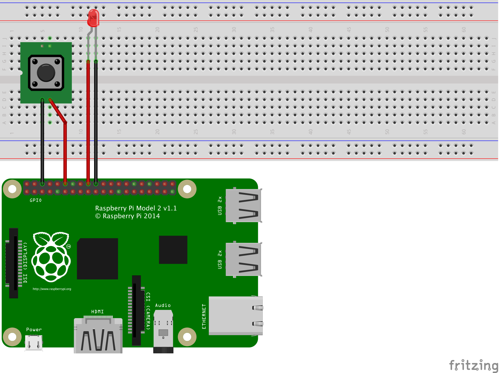

# DOMUSTO GPIO plugin

```
plugin:       RPI GPIO
author:       Bas van Dijk
category:     system
version:      0.0.1
website:      http://domusto.com
description:  Control the GPIO ports of a RPI
```

## Features
- [x] Write GPIO pin high/low
- [x] Read GPIO pin high/low
- [x] Set pullup / pulldown resistor on GPIO pin
- [ ] Write/read analog signal
- [ ] Write/read PWM signal

## Hardware needed
- Raspberry Pi

## Tested with
- Raspberry Pi

## Troubleshooting

You might run into the following error:
```
GPIO Error: pigpio error -1 in gpioInitialise
```

This could mean DOMUSTO server has insufficient rights to access the GPIO ports on your RPI. In this case you have to run DOMUSTO server with root access.

```
sudo npm run dev
```

## Pre-installation requirement

**Install the pigpio C library**

The pigpio Node.js package requires the pigpio C library V41 or higher.

Raspbian Jessie 2016-05-10 or newer comes with the pigpio C library
pre-installed so it need not be manually installed.

Raspbian Jessie Lite 2016-05-10 or newer does not come with the pigpio C
library pre-installed so it must be manually installed with the following
commands:

```
sudo apt-get update
sudo apt-get install pigpio
```

The pigpio C library contains a number of utilities. One of these utilities
is pigpiod which launches the pigpio C library as a daemon. This utility
should not be used as the pigpio Node.js package uses the C library directly.

Installation instructions for the pigpio C library on versions of Raspbian
prior to 2016-05-10 can be found
[here](http://abyz.co.uk/rpi/pigpio/download.html).

Source: https://github.com/fivdi/pigpio/blob/master/README.md

## Installation

Execute in the domusto-server folder:
```sh
$ ./domusto.js plugin add basvdijk/domusto-gpio
```

## Configuration

1. Add the section below to your `config.ts`
2. Set the desired pin configuration
3. Restart DOMUSTO

```js
{
    id: 'GPIO',
    enabled: true,
    settings: {
        pins: [
            {
                pinNumber: 24,
                type: 'output',
            },
            {
                pinNumber: 18,
                type: 'input/NO',
                resistor: 'pullUp'
            }
        ]
    }
},
```

## Example devices
```js

// GPIO18
{
    id: 'RPIPIN18',
    enabled: true,
    role: 'output',
    name: 'IN 18',
    type: 'switch',
    subType: 'on/off',
    plugin: {
        id: 'GPIO',
        deviceId: 'GPIO18'
    }
},

// GPIO24
{
    id: 'RPIPIN24',
    enabled: true,
    role: 'output',
    name: 'OUT 24',
    type: 'switch',
    subType: 'on/off',
    plugin: {
        id: 'GPIO',
        deviceId: 'GPIO24',
    },
}
```



## Reading the GPIO pin status from terminal

```bash
$ sudo apt-get install wiringpi

$ gpio readall
 +-----+-----+---------+------+---+---Pi 3---+---+------+---------+-----+-----+
 | BCM | wPi |   Name  | Mode | V | Physical | V | Mode | Name    | wPi | BCM |
 +-----+-----+---------+------+---+----++----+---+------+---------+-----+-----+
 |     |     |    3.3v |      |   |  1 || 2  |   |      | 5v      |     |     |
 |   2 |   8 |   SDA.1 | ALT0 | 1 |  3 || 4  |   |      | 5v      |     |     |
 |   3 |   9 |   SCL.1 | ALT0 | 1 |  5 || 6  |   |      | 0v      |     |     |
 |   4 |   7 | GPIO. 7 |   IN | 1 |  7 || 8  | 0 | IN   | TxD     | 15  | 14  |
 |     |     |      0v |      |   |  9 || 10 | 1 | IN   | RxD     | 16  | 15  |
 |  17 |   0 | GPIO. 0 |   IN | 0 | 11 || 12 | 0 | IN   | GPIO. 1 | 1   | 18  |
 |  27 |   2 | GPIO. 2 |   IN | 0 | 13 || 14 |   |      | 0v      |     |     |
 |  22 |   3 | GPIO. 3 |   IN | 0 | 15 || 16 | 0 | IN   | GPIO. 4 | 4   | 23  |
 |     |     |    3.3v |      |   | 17 || 18 | 0 | IN   | GPIO. 5 | 5   | 24  |
 |  10 |  12 |    MOSI | ALT0 | 0 | 19 || 20 |   |      | 0v      |     |     |
 |   9 |  13 |    MISO | ALT0 | 0 | 21 || 22 | 0 | IN   | GPIO. 6 | 6   | 25  |
 |  11 |  14 |    SCLK | ALT0 | 0 | 23 || 24 | 1 | OUT  | CE0     | 10  | 8   |
 |     |     |      0v |      |   | 25 || 26 | 1 | OUT  | CE1     | 11  | 7   |
 |   0 |  30 |   SDA.0 |   IN | 1 | 27 || 28 | 1 | IN   | SCL.0   | 31  | 1   |
 |   5 |  21 | GPIO.21 |   IN | 1 | 29 || 30 |   |      | 0v      |     |     |
 |   6 |  22 | GPIO.22 |   IN | 1 | 31 || 32 | 0 | IN   | GPIO.26 | 26  | 12  |
 |  13 |  23 | GPIO.23 |   IN | 0 | 33 || 34 |   |      | 0v      |     |     |
 |  19 |  24 | GPIO.24 |   IN | 0 | 35 || 36 | 0 | IN   | GPIO.27 | 27  | 16  |
 |  26 |  25 | GPIO.25 |   IN | 0 | 37 || 38 | 0 | IN   | GPIO.28 | 28  | 20  |
 |     |     |      0v |      |   | 39 || 40 | 0 | IN   | GPIO.29 | 29  | 21  |
 +-----+-----+---------+------+---+----++----+---+------+---------+-----+-----+
 | BCM | wPi |   Name  | Mode | V | Physical | V | Mode | Name    | wPi | BCM |
 +-----+-----+---------+------+---+---Pi 3---+---+------+---------+-----+-----+
```


